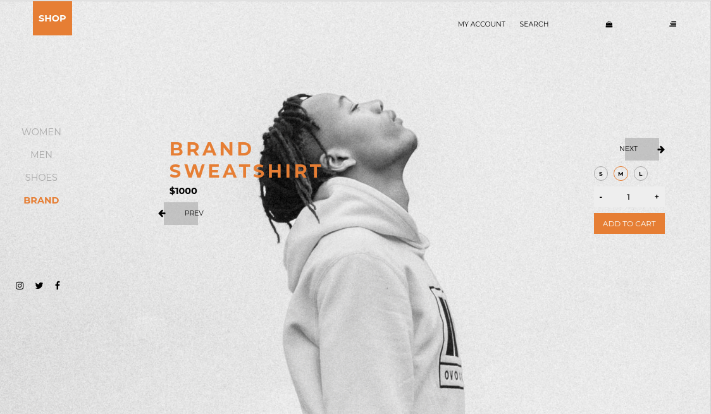

# Shop Website
Este é um projeto com a finalidade de evoluir minhas skills como programadora. Ele consiste em um desafio 
que tem como finalidade criar um site de uma loja com um carrinho de compras.
O desafio pode ser encontrado no site 
[DevChallange](https://www.devchallenge.com.br/detail/5ee261fdff321432500c7599).

## Demo
     

## Linguagens
* HTML
* CSS

## Executar
**Para executar este projeto na sua máquina, siga as instruções:**
* execute o seguinte comando no seu terminal:
`$ git clone https://github.com/dhayananascimento/DevChallenge-shop.git`
* abra a pasta que será  criada
* abra o arquivo "index.html" com o navegador de sua preferência
